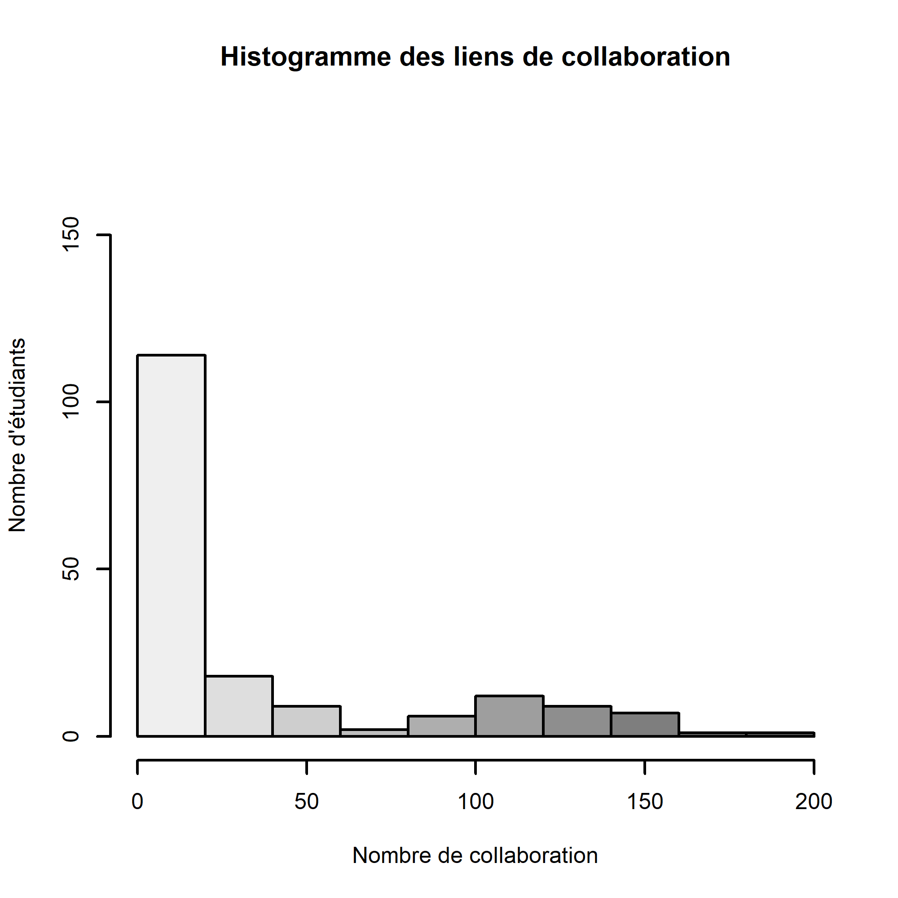

#Resume

La collaboration est une forme de travail où l'énergie est mise à profit à l'aide de plusieurs personnes permettant l'atteinte d'un but commun qui sera favorable pour tous. C'est cette forme de travail qui sera décortiquée dans ce travail à l'aide des différentes collaborations que les élèves en Baccalauréat en Écologie de l'Université de Sherbrooke dans le cadre du cours BIO500 ont eu à avoir tout au long de leur cheminement. Ce travail vise à comprendre à quoi ressemble le réseau de collaboration, combien de collaborations que chacun des étudiants ont dû avoir pour l'obtention de leur diplôme et suit-elle une tendance quelconque et finalement quel cours possède le plus grand nombre de collaborations recensées. Il a été démontré à l'aide des données obtenues que..

#Introduction

La collaboration est une forme d'aide où plusieurs personnes mettent en œuvre ces compétences pour l'atteinte d'un but commun précis, et ce dans plusieurs sphères. En écologie, il a été démontré à plusieurs reprises que la collaboration à son lot d'avantages concrets dans plusieurs sphères, soit dans le milieu animal, végétal et même chez l'humain. La recherche en écologie, nécessite l'apport de plusieurs connaissances adjacentes afin d'obtenir des résultats plus fiables vu la complexité de la discipline (Goring et al., 2014). C'est principalement cette interactions qui sera décortiquée dans le cadre du cours Méthodologie computationnelle donnés aux étudiants finissants au Baccalauréat en Écologie à l'Université de Sherbrooke. En effet, une collecte de données à été réalisée afin d'évaluer la collaboration de chacun des étudiants présents dans ce cours avec d'autres élèves tout au long de leur cheminement académique. Le nombre total de collaboration pour chaque étudiant suit-elle une tendance particulière? Quels cours ont un plus nombre de collaborations? Et à quoi ressemble le réseau de collaboration au total sont des questions qui seront répondu dans ce présent rapport.

#Methode et resultats

En généralité, une collecte de données à été réalisée en sondant l'entièreté des élèves présents dans le cours méthodes computationnelles au Baccalauréat en Écologie en hiver 2023. Différents fichiers ont dû être dûment remplis afin d'éviter les oublis généralement réalisés par les étudiants. Ces fichiers avaient pour but de sonder les élèves à savoir les différentes informations sur l'entièreté des cours suivis pour l'obtention de leur diplome de premier cycle à l'université, leurs informations personnels pour obtenir un historique de base des différents étudiants dans le cours et le dernier fichier avait pour but l'énumération de l'entièreté des collaborations que les étudiants ont eu à avoir pour les différents travaux réalisés dans les différents cours. 

Ces trois fichiers ont dû être examinés en profondeur afin d'éliminer toutes les incohérences, les erreurs de typographie, les doublons et les autres erreurs présentes. 

#Figure du reseau de collab

 #Figure 1

#Figure 2 
